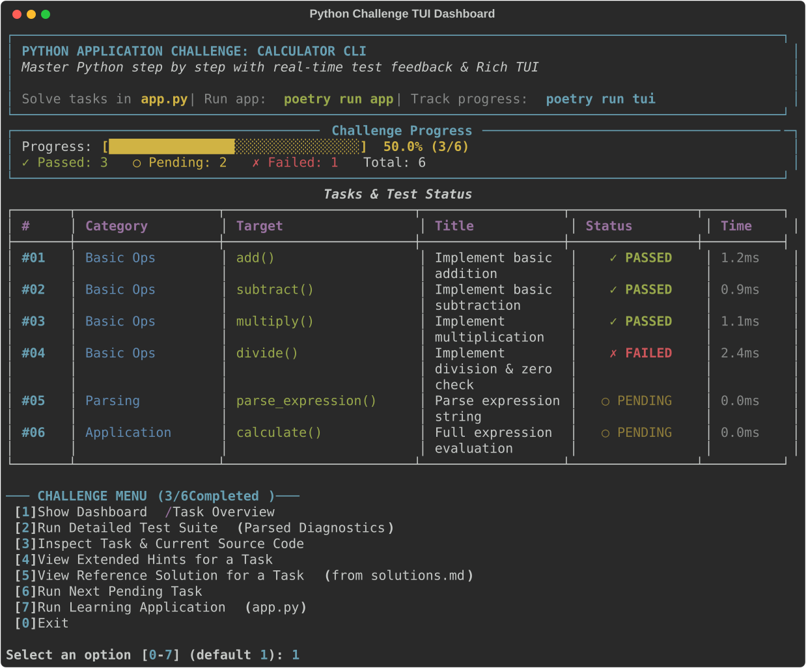

# 🐍 Python Challenge & App Generator (`generate-python-exercise-project`)

An agentic skill that automatically generates complete, interactive, test-driven Python coding challenge projects and executable learning applications featuring a [Rich](https://github.com/Textualize/rich) TUI dashboard, progressive test diagnostics, automated setup scripts, and reference solutions.

---

## 🚀 How to Use

Invoke this skill in Antigravity or any compatible agent by prompting or using the slash command:

```text
/generate-python-exercise-project Build an interactive calculator application challenge with 6 tasks
```

Or simply ask naturally:
> *"Create an interactive Python challenge for a calculator app where I can build and run app.py with poetry run app."*
> *"Generate an interactive Python challenge on list comprehension with 10 exercises."*

---

## 📦 Supported Project Modes

### 1. Executable Application Challenge (e.g. Calculator, CLI Tool, Mini-Game)
- **`app.py`**: The runnable learning application with `main()`, interactive command loop/CLI, and modular stubs for the learner to implement.
- **`test_app.py`**: Automated unit tests validating the application's core functions.
- **`tui.py`**: Rich TUI challenge dashboard & progress tracker (`poetry run tui`).

### 2. Exercise Collection (e.g. Dictionaries, Algorithms, OOP)
- **`exercises.py`**: Standalone function stubs with `NotImplementedError`.
- **`test_exercises.py`**: Unittest suite testing edge and standard cases.
- **`tui.py`**: Rich TUI challenge dashboard & progress tracker.

---

## 🖥️ Interactive Rich TUI Dashboard



---

## 🛠️ CLI & Poetry Commands

| Action | Poetry Command | Direct Python Command |
| :--- | :--- | :--- |
| **Run Executable App** | `poetry run app` | `python app.py` |
| **Launch TUI Dashboard** | `poetry run tui` | `python tui.py` |
| **Run All Tests** | `poetry run test` | `python tui.py --test` |
| **Quick Progress Check** | `poetry run tui --check` | `python tui.py --check` |
| **Inspect Specific Task** | `python tui.py --task <id>` | `python tui.py --task <id>` |
| **View Solution Hints** | `python tui.py --hint <id>` | `python tui.py --hint <id>` |
| **View Reference Solution** | `python tui.py --solution <id>` | `python tui.py --solution <id>` |

---

## 📂 Included Templates

The skill comes pre-packaged with robust templates in `templates/`:
- `templates/tui_template.py`: The complete Rich TUI engine with unittest result interception, progress bar, hints, and reference solution viewer.
- `templates/app_template.py`: Starter template for an executable CLI application with interactive REPL loop and `main()` entrypoint.
- `templates/pyproject_template.toml`: Configured Poetry project file defining `app`, `tui`, and `test` scripts.
- `templates/setup_template.bat`: Windows setup script.
- `templates/setup_template.sh`: Unix/macOS setup script.
